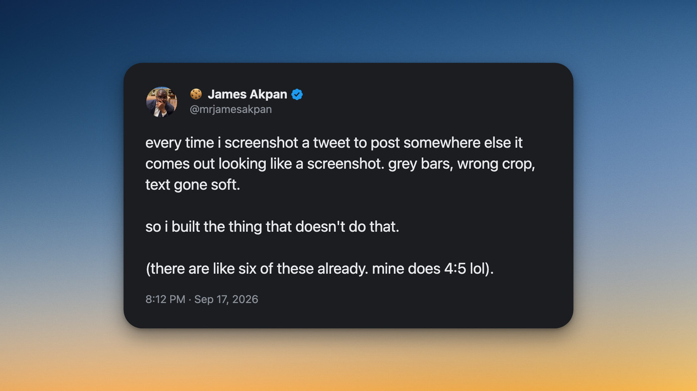
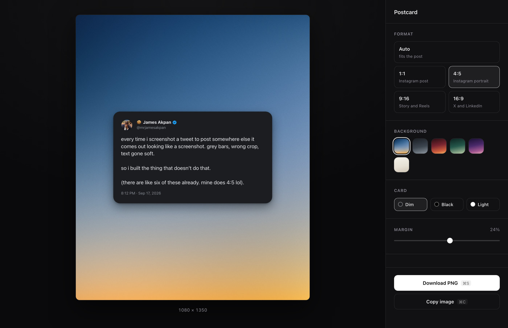
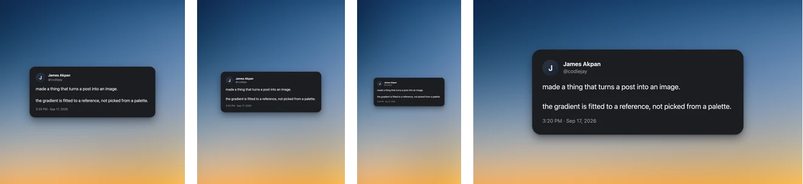
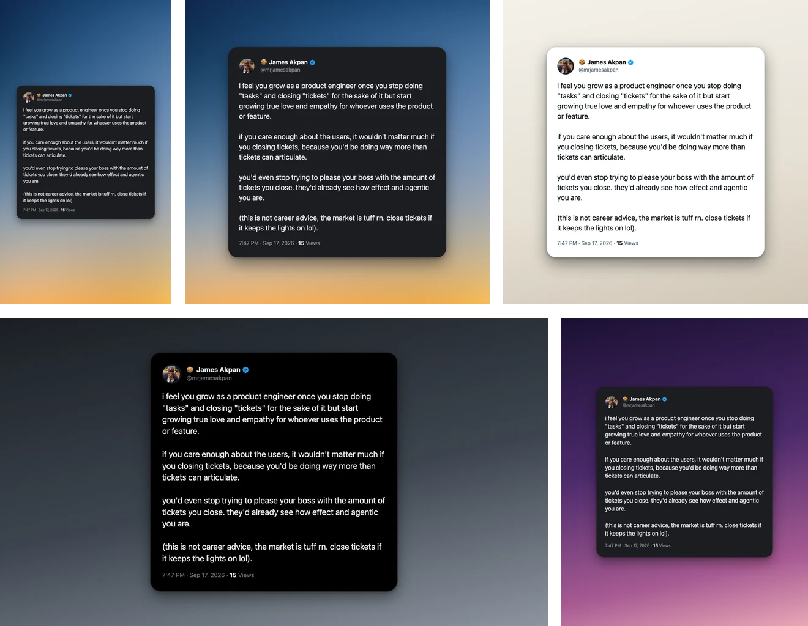

# Postcard

Turn a post on X into an image you can put on Instagram.



Adds one button to the end of every post's action row. Click it and the post
opens in a studio tab, sitting on a gradient, ready to download at the size you
need.

## Install

1. Download `postcard.zip` from the [latest release](https://github.com/codiejay/postcard/releases/latest/download/postcard.zip) and unzip it somewhere permanent, not Downloads.
2. Open `chrome://extensions`
3. Turn on Developer mode, top right.
4. Load unpacked, then pick the folder you unzipped.

Keep that folder where it is. Chrome loads the extension from that exact path,
so moving it breaks the install. It isn't on the Chrome Web Store, so there are
no auto-updates.

## The studio



The button reads the post out of the page: name, handle, verified badge, text,
emoji, timestamp, view count, and up to four photos. Avatars and photos are
refetched at full resolution, so the export is sharp rather than a scaled-up
thumbnail.

- **Format** — Auto, 1:1, 4:5, 9:16, 16:9.
- **Background** — six gradients. Dusk is the default.
- **Card** — Dim, Black, or Light.
- **Margin** — how much gradient sits around the card.

Download saves a PNG. Copy puts it on the clipboard. ⌘S and ⌘C do the same.
Your last choices are remembered for the next post.

## Formats



| Format | Exports at | For |
| --- | --- | --- |
| 1:1 | 1080 × 1080 | Instagram post |
| 4:5 | 1080 × 1350 | Instagram portrait |
| 9:16 | 1080 × 1920 | Story and Reels |
| 16:9 | 1920 × 1080 | X and LinkedIn |
| Auto | fits the post | anywhere |

Instagram recompresses anything that isn't one of its own sizes, which is where
the mush comes from. Hitting the size exactly leaves the file alone.

## Samples



The same post, different settings. Dusk at 9:16 and 1:1, Paper with a light
card, Slate with a black card at 16:9, and Plum at 4:5. The 9:16 one is a real
export, made with the extension and not touched afterwards.

## About the Dusk gradient

Dusk is not a hand-written set of colour stops. It is a degree-4 polynomial
colour field, one polynomial per channel, fitted to a reference image over
normalised coordinates:

```
channel(u, v) = Σ c · u^i · v^j     for i + j ≤ 4
```

Mean error against the source is 1.6 out of 255, which is below what an eye can
see. The coefficients live in `studio/backgrounds.js`.

Fitting it this way rather than eyeballing stops buys two things. The gradient
is diagonal and slightly curved, which no single linear gradient reproduces. And
because the field is defined on normalised coordinates, it re-flows correctly
from a wide 16:9 frame to a tall 9:16 one instead of being stretched.

A little grain is composited on top. The source image has it, and it keeps large
exports from banding.

## How it renders

There is one renderer, `studio/render.js`, and it draws to a canvas. The preview
is that canvas at screen scale; the download is the same call at export scale.
There is no second code path, so the file you get is the thing you were looking
at.

## Files

```
manifest.json
src/content.js       injects the button, reads the post
src/content.css      button styling, matched to X's action row
src/background.js    fetches images, stashes the post, opens the studio
studio/render.js     canvas renderer: layout, text wrapping, media grids
studio/backgrounds.js  the gradients and the fitted colour field
studio/studio.js     controls, export, settings
dev/package.sh       builds the release zip
```

## Building a release

```
./dev/package.sh
```

The asset is always named `postcard.zip`, never versioned. GitHub's permanent
link is `/releases/latest/download/postcard.zip`, which resolves by filename, so
a versioned asset silently breaks every link pointing at it. The version lives
in the manifest and the release tag.

## Known gaps

- Quote tweets, polls, and threads are not rendered. A quoted post is dropped.
- Videos use their poster frame.
- View counts only exist on a post's own page, not in the timeline.

## Licence

MIT. The post in the samples is real. The one in the hero and studio shots is a
mock-up, made with the tool.
