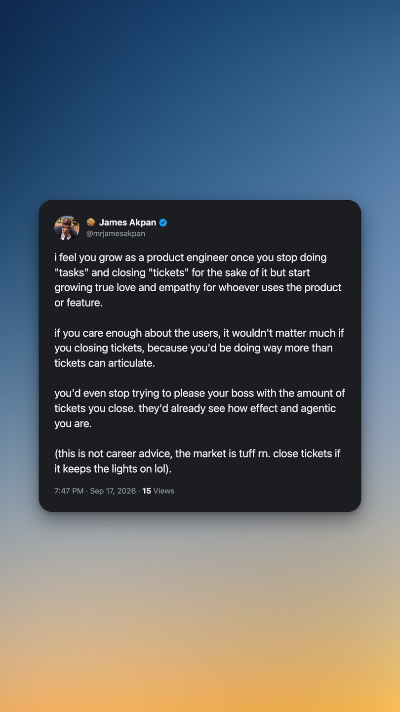

# Postcard

Chrome extension. Turns a post on X into an image at Instagram's exact pixel
sizes.



## Install

Not on the Chrome Web Store.

1. Download [`postcard.zip`](https://github.com/codiejay/postcard/releases/latest/download/postcard.zip)
   and unzip it somewhere permanent, not Downloads.
2. Open `chrome://extensions`
3. Turn on Developer mode, top right.
4. Load unpacked, pick the folder.

Chrome loads the extension from that exact path, so moving the folder breaks it.
No auto-updates.

## Use

One button at the end of every post's action row, after share. It opens a studio
tab.

| Control | Options |
|---|---|
| Format | Auto, 1:1, 4:5, 9:16, 16:9 |
| Background | six gradients |
| Card | Dim, Black, Light |
| Margin | how much gradient sits around the card |

`⌘S` downloads a PNG, `⌘C` copies one. Last settings load next time.

| Format | Exports at |
|---|---|
| 1:1 | 1080 × 1080 |
| 4:5 | 1080 × 1350 |
| 9:16 | 1080 × 1920 |
| 16:9 | 1920 × 1080 |
| Auto | fits the post |

Instagram recompresses anything that isn't one of its own sizes.

## Dusk

The default gradient is a degree-4 polynomial colour field, one polynomial per
channel, fitted to a reference image over normalised coordinates:

```
channel(u, v) = Σ c · u^i · v^j     for i + j ≤ 4
```

Mean error against the source is 1.6 of 255. The best single linear gradient fit
was 7.4. Coefficients are in `studio/backgrounds.js`.

Normalised coordinates mean it re-flows between aspect ratios instead of
stretching. Grain sits over the top at 3.5% to stop large exports banding.

## Notes

`studio/render.js` draws both the preview and the export. Same call, different
scale.

Reads name, handle, verified badge, text, emoji, timestamp, view count, up to
four photos, and link previews with their title and domain. Avatar and images
are refetched at full resolution.

Not handled: quote tweets, polls, threads. Video uses the poster frame. View
counts only exist on a post's own page.

## Release

```
./dev/package.sh
```

The asset must stay named `postcard.zip`. GitHub's
`/releases/latest/download/postcard.zip` resolves by filename, so a versioned
asset breaks every link pointing at it. Version lives in the manifest and the
tag.

MIT.
